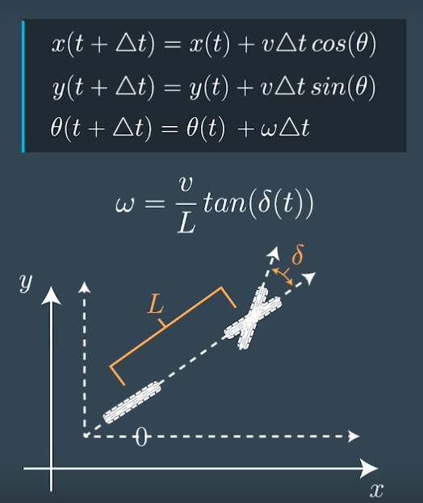

# Modular Implementation of the Hybrid A* algorithm

The goal here is to create a modular A* algorithm library which provides an interface for how the state should be defined and then resolves the path planning problem.

### Map

* The start location is marked `?`.
* The goal location is marked `@`.
* The inaccessible locations are `X`.
* Each visited locations on the path to the goal is marked `*`.

Here is a raw map for the robots to use:

```
? X X 0 0 0 0 0 0 0 X X 0 0 0 0
0 X X 0 0 0 0 0 0 X X 0 0 0 0 0
0 X X 0 0 0 0 0 X X 0 0 0 0 0 0
0 X X 0 0 0 0 X X 0 0 0 X X X 0
0 X X 0 0 0 X X 0 0 0 X X X 0 0
0 X X 0 0 X X 0 0 0 X X X 0 0 0
0 X X 0 X X 0 0 0 X X X 0 0 0 0
0 X X X X 0 0 0 X X X 0 0 0 0 0
0 X X X 0 0 0 X X X 0 0 0 0 0 0
0 X X 0 0 0 X X X 0 0 X X X X X
0 X 0 0 0 X X X 0 0 X X X X X X
0 0 0 0 X X X 0 0 X X X X X X X
0 0 0 X X X 0 0 X X X X X X X X
0 0 X X X 0 0 X X X X X X X X X
0 X X X 0 0 0 0 0 0 0 0 0 0 0 0
X X X 0 0 0 0 0 0 0 0 0 0 0 0 @
```

### Holonomic Robot Motion


### Non-holonomic robot motion.

In this case I decided to simulate the motion of a robot using the bicycle model.



Some locations seem "jumped" because the speed of the robot is greater than the size of each cells per iterations.


```
Found path to goal in 12904 expansions.

? X X 0 0 0 0 0 0 0 X X 0 0 0 0 0 X X 0 0 0 0 0 0 0 0 0 0 0 0 0 0
* X X 0 0 0 0 0 0 X X 0 0 0 0 0 0 X X 0 0 0 0 0 0 0 0 0 0 0 0 0 0
* X X 0 0 0 0 0 X X 0 0 * * 0 0 0 X X 0 0 0 0 0 0 0 0 0 0 0 0 0 0
0 X X 0 0 0 0 X X 0 0 * X X X 0 0 X X 0 0 0 0 0 0 0 0 0 0 0 0 0 0
* X X 0 0 0 X X 0 0 * X X X * 0 0 X X 0 0 0 0 0 0 0 0 0 0 0 0 0 0
* X X 0 0 X X 0 0 * X X X * 0 0 0 X X 0 0 0 0 0 0 0 0 0 0 0 0 0 0
* X X 0 X X 0 0 * X X X * * 0 0 0 X X 0 0 0 0 0 0 0 0 0 0 0 0 0 0
0 X X X X 0 0 * X X X 0 * 0 0 0 0 X X 0 0 0 0 0 0 0 0 0 0 0 0 0 0
* X X X 0 0 * X X X 0 * 0 0 0 0 0 X X 0 0 0 0 0 0 0 0 0 0 0 0 0 0
* X X 0 0 * X X X 0 * X X X X X X X X 0 0 0 0 0 0 0 0 0 0 0 0 0 0
0 X * 0 * X X X 0 * X X X X X X X X X 0 0 0 0 0 0 0 0 0 0 0 0 0 0
0 0 0 * X X X 0 * X X X X X X X X X X 0 0 0 0 0 0 0 0 0 0 0 0 0 0
0 0 0 X X X 0 * X X X X X X X X X X X 0 0 0 0 0 0 0 0 0 0 0 0 0 0
0 0 X X X 0 0 X X X X X X X X X X X X 0 0 0 0 0 * * X * * 0 0 0 0
0 X X X 0 0 0 0 * 0 0 0 0 0 0 0 0 0 0 0 0 0 0 * 0 X X X 0 * 0 0 0
X X X 0 0 0 0 0 0 * * * 0 * * 0 * * * 0 * * 0 * X X X X X 0 * * @
```